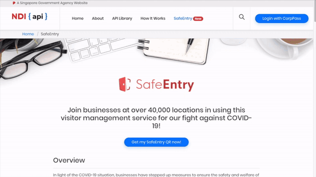
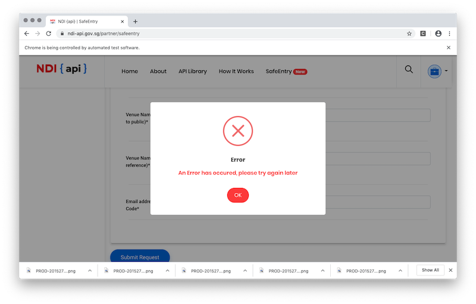

## WARNING

Use this at your own risk.

### Mass application of SafeEntry QR code

This [python script](main.py) controls [Selenium](https://selenium-python.readthedocs.io/) to navigate through [SafeEntry website](https://www.ndi-api.gov.sg/partner/safeentry) and allow bulk application of QR codes through automation.

You will only need to login once using CorpPass and all the QR codes will be generated at one go, if nothing goes wrong.



Yes, things do break:




#### What is the motivation?

I had to create register 550 sites for SafeEntry QR application and doing this by hand will likely result in human error and, it's super slowwww and repetitive..

This application can create a QR code every 5 to 8 seconds. The time I took to create 12 of them was about 75 seconds.

#### Things that you will require beforehand

1. Singpass mobile app
2. UEN number
3. CorpPass ID
4. CorpPass Password
5. List of locations to create QR codes

### Stuff to install

1. `$ pip3 install selenium`
2. Download [chromedriver](https://chromedriver.chromium.org/downloads) and place it in this folder


#### What to configure in the script

```
DOWNLOAD_DIR = ""    # Location to store the QR codes
UEN_ID = ""          # UEN Number
CORPPASS_ID = ""     # CorpPass ID
PASSWORD = ""        # CorpPass password
EMAIL_ADDRESSES = "" # List of emails to send QR to, delimited by comma
```